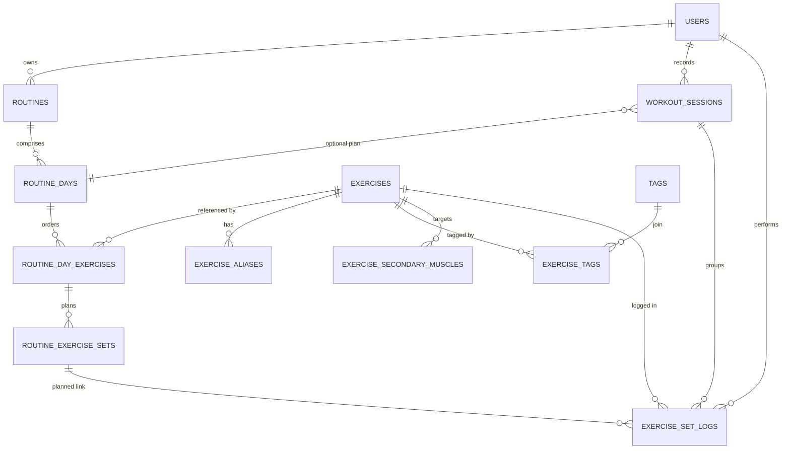

# FitnessTrack Data Model (app.models)

Documentation for the SQLAlchemy models powering authentication, exercise cataloguing, training plans, and workout tracking.

## Entity-Relationship Diagram



## Core Entities

| Model | Table | Purpose |
| --- | --- | --- |
| `User` | `users` | Accounts with anthropometrics and authentication metadata. |
| `Exercise` | `exercises` | Catalog of exercises including biomechanical enums and media fields. |
| `Routine` | `routines` | User-owned mesocycles composed of routine days and planned sets. |
| `RoutineDay` | `routine_days` | Represents each day within a routine cycle, optionally marked as rest. |
| `RoutineDayExercise` | `routine_day_exercises` | Ordered exercise slots inside a routine day. |
| `RoutineExerciseSet` | `routine_exercise_sets` | Planned set prescriptions (load, reps, RIR/RPE, tempo, rest). |
| `WorkoutSession` | `workout_sessions` | Actual workout sessions with optional linkage to the planned routine day. |
| `ExerciseSetLog` | `exercise_set_logs` | Performed sets with actual metrics, optionally linked to a planned set. |
| `ExerciseAlias` | `exercise_aliases` | Alternative names for exercises to improve search and localization. |
| `Tag` / `ExerciseTag` | `tags` / `exercise_tags` | Curated tagging system for exercises (many-to-many). |
| `ExerciseSecondaryMuscle` | `exercise_secondary_muscles` | Normalized mapping of secondary muscle targets for an exercise. |

## Relationships

| Relationship | Type | Notes |
| --- | --- | --- |
| `User` → `Routine` | 1:N | Cascade delete; routines removed when the user is deleted. `Routine.user_id` is non-null. |
| `User` → `WorkoutSession` | 1:N | Cascade delete; ensures workout history is user-scoped. Optional link from session to `RoutineDay`. |
| `User` → `ExerciseSetLog` | 1:N | Cascade delete to clean logs when a user is removed. |
| `Routine` → `RoutineDay` | 1:N | Days cascade on routine deletion. Uniqueness enforced per `day_index`. |
| `RoutineDay` → `RoutineDayExercise` | 1:N | Ordered exercises per day with uniqueness on `(routine_day_id, position)`. |
| `RoutineDayExercise` → `RoutineExerciseSet` | 1:N | Planned sets per exercise with uniqueness on `(routine_day_exercise_id, set_index)`. |
| `Exercise` → `RoutineDayExercise` | 1:N | Each planned exercise references a catalog entry; cascades on exercise deletion. |
| `Exercise` ↔ `Tag` | N:M | Implemented via `ExerciseTag` join table with composite PK and cascade deletes. |
| `Exercise` → `ExerciseAlias` | 1:N | Alias rows cascade on exercise deletion. |
| `Exercise` → `ExerciseSecondaryMuscle` | 1:N | Composite primary key `(exercise_id, muscle)` prevents duplicates. |
| `WorkoutSession` → `ExerciseSetLog` | 1:N | Optional; logs can exist without a session but cascade when a session is deleted. |
| `RoutineExerciseSet` → `ExerciseSetLog` | 1:N | Optional; allows adherence analytics while keeping performed sets when the plan set is removed. |

## Conventions & Constraints

- **Mixins:** `PKMixin`, `TimestampMixin`, and `ReprMixin` provide integer IDs, timestamp columns, and debug-friendly reprs. Apply them to new models for consistency.【F:backend/app/models/base.py†L1-L52】【F:backend/app/models/routine.py†L23-L106】
- **Timestamps:** Most entities include `created_at` / `updated_at` with database defaults (`func.now`) to keep time in UTC at the database level.【F:backend/app/models/user.py†L24-L41】【F:backend/app/models/exercise.py†L68-L86】【F:backend/app/models/routine.py†L27-L106】【F:backend/app/models/workout.py†L29-L58】【F:backend/app/models/exercise_log.py†L34-L77】
- **Uniqueness:** Email, username, exercise slugs, per-day exercise ordering, and per-set planning/log combinations all rely on explicit `UniqueConstraint`s to enforce business rules.【F:backend/app/models/user.py†L43-L49】【F:backend/app/models/exercise.py†L88-L111】【F:backend/app/models/routine.py†L43-L105】【F:backend/app/models/workout.py†L59-L73】【F:backend/app/models/exercise_log.py†L78-L96】
- **Indices:** Strategic secondary indices support search (e.g., exercise names), chronological queries, and join performance.【F:backend/app/models/user.py†L43-L49】【F:backend/app/models/exercise.py†L88-L111】【F:backend/app/models/routine.py†L43-L105】【F:backend/app/models/workout.py†L59-L73】【F:backend/app/models/exercise_log.py†L78-L96】
- **Foreign keys & Cascades:** Deletions cascade for child records (aliases, routine structures, logs) while optional references use `SET NULL` to preserve history when the parent is removed.【F:backend/app/models/exercise.py†L103-L111】【F:backend/app/models/routine.py†L32-L105】【F:backend/app/models/workout.py†L31-L56】【F:backend/app/models/exercise_log.py†L33-L73】

## Mapping to the Canonical Schema

The SQLAlchemy definitions align with the canonical schema exported in [`docs/dbdiagram.sql`](../../docs/dbdiagram.sql). Use the ERD source to cross-check column types, enum values, and constraint names before applying migrations.【F:docs/dbdiagram.sql†L1-L178】【F:docs/dbdiagram.sql†L200-L271】

## Development Notes

1. **Migrations:** This service uses Alembic migrations located in `backend/migrations`. Run `flask db migrate` / `flask db upgrade` (or the project-specific wrappers) after modifying models to keep the database schema synchronized.【F:backend/migrations/env.py†L1-L121】
2. **Adding models:** Define new models under this package, import them in `app/models/__init__.py`, and register relationships using the existing mixins for consistency.【F:backend/app/models/__init__.py†L1-L26】
3. **Updating docs:** When the schema changes, regenerate the ERD in dbdiagram.io and export the updated SQL into `docs/dbdiagram.sql` to keep this documentation accurate.

## Example Usage

```python
from sqlalchemy.orm import Session
from app.models import User, Routine, RoutineDay


def create_routine(session: Session, user: User) -> Routine:
    routine = Routine(user=user, name="PPL Mesocycle")
    routine.days.append(RoutineDay(day_index=1, title="Push"))
    session.add(routine)
    session.commit()
    session.refresh(routine)
    return routine
```

```python
from sqlalchemy import select
from app.models import ExerciseSetLog


def recent_logs(session: Session, user_id: int, limit: int = 10):
    stmt = (
        select(ExerciseSetLog)
        .where(ExerciseSetLog.user_id == user_id)
        .order_by(ExerciseSetLog.performed_at.desc())
        .limit(limit)
    )
    return session.scalars(stmt).all()
```

## Contributing to the Data Model

- Discuss proposed schema changes with the team before implementation to validate backward compatibility and migration strategy.
- Update both the SQLAlchemy model and corresponding Alembic migration; keep constraint names stable when possible.
- Run database migrations against a local database and execute automated tests touching the ORM to ensure integrity.
- Refresh this README and the `dbdiagram.sql` export whenever enums, relationships, or constraints change.
