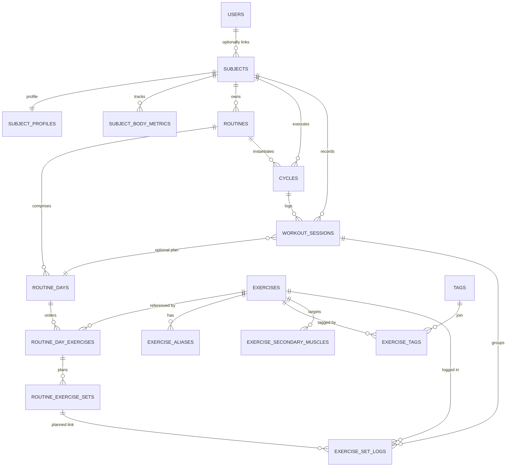

# FitnessTrack Data Model (app.models)

Documentation for the SQLAlchemy models powering authentication, pseudonymous subject management, exercise cataloguing, training plans, and workout tracking.

## Entity-Relationship Diagram



## Core Entities

| Model | Table | Purpose |
| --- | --- | --- |
| `User` | `users` | Authentication identities containing direct PII only. |
| `Subject` | `subjects` | Pseudonymous subject records referenced by all domain data. |
| `SubjectProfile` | `subject_profiles` | Optional 1:1 indirect PII profile (sex, birth year, height). |
| `SubjectBodyMetrics` | `subject_body_metrics` | Historical body metric series (weight, body fat, heart rate). |
| `Exercise` | `exercises` | Catalog of exercises including biomechanical enums and media fields. |
| `ExerciseAlias` | `exercise_aliases` | Alternative names for exercises to improve search and localization. |
| `Tag` | `tags` | Curated tag vocabulary applied to exercises. |
| `ExerciseTag` | `exercise_tags` | Many-to-many association between exercises and tags. |
| `ExerciseSecondaryMuscle` | `exercise_secondary_muscles` | Normalized mapping of secondary muscle targets for an exercise. |
| `Routine` | `routines` | Subject-owned mesocycles composed of routine days and planned sets. |
| `RoutineDay` | `routine_days` | Represents each day within a routine cycle, optionally marked as rest. |
| `RoutineDayExercise` | `routine_day_exercises` | Ordered exercise slots inside a routine day. |
| `RoutineExerciseSet` | `routine_exercise_sets` | Planned set prescriptions (load, reps, RIR/RPE, tempo, rest). |
| `Cycle` | `cycles` | Execution pass through a routine for a subject, grouping sessions. |
| `WorkoutSession` | `workout_sessions` | Actual workout sessions with optional linkage to the planned routine day and cycle. |
| `ExerciseSetLog` | `exercise_set_logs` | Performed sets with actual metrics, optionally linked to a planned set and session. |

### Enumerations

All enums are PostgreSQL-native and mirrored in SQLAlchemy:

| Enum | Values |
| --- | --- |
| `muscle_group` | `CHEST`, `BACK`, `SHOULDERS`, `QUADS`, `HAMSTRINGS`, `GLUTES`, `CALVES`, `BICEPS`, `TRICEPS`, `FOREARMS`, `ABS`, `OBLIQUES`, `FULL_BODY`, `OTHER` |
| `equipment` | `BARBELL`, `DUMBBELL`, `MACHINE`, `CABLE`, `BODYWEIGHT`, `KETTLEBELL`, `BAND`, `SMITH`, `TRAP_BAR`, `EZ_BAR`, `PLATE`, `OTHER` |
| `mechanics` | `COMPOUND`, `ISOLATION` |
| `force_vector` | `PUSH`, `PULL`, `STATIC` |
| `level` | `BEGINNER`, `INTERMEDIATE`, `ADVANCED` |
| `movement_pattern` | `HINGE`, `SQUAT`, `LUNGE`, `HORIZONTAL_PUSH`, `HORIZONTAL_PULL`, `VERTICAL_PUSH`, `VERTICAL_PULL`, `CARRY`, `ROTATION`, `ANTI_ROTATION`, `HIP_ABDUCTION`, `HIP_ADDUCTION`, `CALF_RAISE`, `CORE_BRACE`, `OTHER` |
| `sex` | `MALE`, `FEMALE`, `OTHER`, `PREFER_NOT_TO_SAY` |
| `workout_status` | `PENDING`, `COMPLETED` |

### Detailed Entity Reference

#### `users` (`User`)

Authentication identities with direct PII (email, username, optional full name).

| name | type | nullable | default | constraints | notes |
| --- | --- | --- | --- | --- | --- |
| `id` | `int` | no | auto-increment | PK | Surrogate key. |
| `email` | `varchar(254)` | no | — | unique (`uq_users_email`) | Normalized to lowercase in ORM validator. |
| `password_hash` | `varchar(128)` | no | — | — | Write-only setter populates hash. |
| `username` | `varchar(50)` | no | — | unique (`uq_users_username`) | Trimmed via ORM validator. |
| `full_name` | `varchar(100)` | yes | — | — | Optional real name. |
| `created_at` | `timestamptz` | no | `now()` | — | From `TimestampMixin`. |
| `updated_at` | `timestamptz` | no | `now()` | — | Updated via DB trigger/mixin. |

**Relationships**

| relation | cardinality | via | delete behavior | notes |
| --- | --- | --- | --- | --- |
| `subject` | 1:0..1 | `subjects.user_id` | `SET NULL` | Optional link enabling anonymization. |

**Indexes**

- `ix_users_email` (`email`)
- `ix_users_username` (`username`)

**Schema vs ORM parity**

- No differences detected.

#### `subjects` (`Subject`)

Pseudonymous domain subjects; optional 1:1 link to `users` and owners of routines, cycles, workouts, and logs.

| name | type | nullable | default | constraints | notes |
| --- | --- | --- | --- | --- | --- |
| `id` | `int` | no | auto-increment | PK | Surrogate key. |
| `user_id` | `int` | yes | — | unique (`uq_subjects_user`) | FK to `users.id` (`SET NULL`). |
| `pseudonym` | `uuid` | no | — | unique (`uq_subjects_pseudonym`) | Stable pseudonymous identifier. |
| `created_at` | `timestamptz` | no | `now()` | — | — |
| `updated_at` | `timestamptz` | no | `now()` | — | — |

**Relationships**

| relation | cardinality | via | delete behavior | notes |
| --- | --- | --- | --- | --- |
| `user` | 0..1:1 | `subjects.user_id` | `SET NULL` | Breaks link during anonymization. |
| `profile` | 1:0..1 | `subject_profiles.subject_id` | `CASCADE` | Optional indirect PII profile. |
| `body_metrics` | 1:N | `subject_body_metrics.subject_id` | `CASCADE` | Time-series measurements. |
| `routines` | 1:N | `routines.subject_id` | `CASCADE` | Planned training templates. |
| `cycles` | 1:N | `cycles.subject_id` | `CASCADE` | Execution passes. |
| `workouts` | 1:N | `workout_sessions.subject_id` | `CASCADE` | Recorded sessions. |
| `exercise_logs` | 1:N | `exercise_set_logs.subject_id` | `CASCADE` | Performed sets. |

**Indexes**

- `ix_subjects_user` (`user_id`)
- `ix_subjects_pseudonym` (`pseudonym`)

**Schema vs ORM parity**

- ORM assigns a client-side default (`uuid4`) for `pseudonym`; the SQL schema does not declare a database default.

#### `subject_profiles` (`SubjectProfile`)

Optional 1:1 profile storing indirect PII (sex, birth year, height, dominant hand).

| name | type | nullable | default | constraints | notes |
| --- | --- | --- | --- | --- | --- |
| `id` | `int` | no | auto-increment | PK | — |
| `subject_id` | `int` | no | — | unique (`uq_subject_profiles_subject`) | FK to `subjects.id` (`CASCADE`). |
| `sex` | `sex` enum | yes | — | — | Stored as PostgreSQL enum. |
| `birth_year` | `int` | yes | — | — | Validators enforce >=1900 and <= current year. |
| `height_cm` | `int` | yes | — | — | Positive enforcement in ORM helper. |
| `dominant_hand` | `varchar(10)` | yes | — | — | Free-form short string. |
| `created_at` | `timestamptz` | no | `now()` | — | — |
| `updated_at` | `timestamptz` | no | `now()` | — | — |

**Relationships**

| relation | cardinality | via | delete behavior | notes |
| --- | --- | --- | --- | --- |
| `subject` | 1:1 | `subject_profiles.subject_id` | `CASCADE` | Back-populates `Subject.profile`. |

**Indexes**

- `ix_subject_profiles_subject_id` (`subject_id`)

**Schema vs ORM parity**

- No differences detected.

#### `subject_body_metrics` (`SubjectBodyMetrics`)

Subject-level historical measurements (weight, body fat, resting heart rate, notes).

| name | type | nullable | default | constraints | notes |
| --- | --- | --- | --- | --- | --- |
| `id` | `int` | no | auto-increment | PK | — |
| `subject_id` | `int` | no | — | — | FK to `subjects.id` (`CASCADE`). |
| `measured_on` | `date` | no | — | unique with `subject_id` (`uq_sbm_subject_day`) | Measurement date. |
| `weight_kg` | `numeric(5,2)` | yes | — | — | Non-negative validation in ORM helper. |
| `bodyfat_pct` | `numeric(4,1)` | yes | — | — | ORM helper enforces 0–100 range. |
| `resting_hr` | `int` | yes | — | — | Positive enforcement in ORM helper. |
| `notes` | `text` | yes | — | — | Optional comments. |
| `created_at` | `timestamptz` | no | `now()` | — | — |
| `updated_at` | `timestamptz` | no | `now()` | — | — |

**Relationships**

| relation | cardinality | via | delete behavior | notes |
| --- | --- | --- | --- | --- |
| `subject` | N:1 | `subject_body_metrics.subject_id` | `CASCADE` | Back-populates `Subject.body_metrics`. |

**Indexes**

- `ix_sbm_subject_id` (`subject_id`)
- `ix_sbm_measured_on` (`measured_on`)

**Schema vs ORM parity**

- No differences detected.

#### `exercises` (`Exercise`)

Exercise catalog enriched with biomechanical metadata, cues, instructions, and media references.

| name | type | nullable | default | constraints | notes |
| --- | --- | --- | --- | --- | --- |
| `id` | `int` | no | auto-increment | PK | — |
| `name` | `varchar(120)` | no | — | — | Indexed for search. |
| `slug` | `varchar(140)` | no | — | unique (`uq_exercises_slug`) | URL-friendly identifier. |
| `primary_muscle` | `muscle_group` | no | — | — | Enum. |
| `movement` | `movement_pattern` | no | — | — | Enum. |
| `mechanics` | `mechanics` | no | — | — | Enum. |
| `force` | `force_vector` | no | — | — | Enum. |
| `unilateral` | `boolean` | no | `false` | — | — |
| `equipment` | `equipment` | no | — | — | Enum. |
| `grip` | `varchar(50)` | yes | — | — | — |
| `range_of_motion` | `text` | yes | — | — | — |
| `difficulty` | `level` | no | `'BEGINNER'` | — | Enum default. |
| `cues` | `text` | yes | — | — | — |
| `instructions` | `text` | yes | — | — | — |
| `video_url` | `varchar(255)` | yes | — | — | — |
| `is_active` | `boolean` | no | `true` | — | Soft disable toggle. |
| `created_at` | `timestamptz` | no | `now()` | — | — |
| `updated_at` | `timestamptz` | no | `now()` | — | — |

**Relationships**

| relation | cardinality | via | delete behavior | notes |
| --- | --- | --- | --- | --- |
| `aliases` | 1:N | `exercise_aliases.exercise_id` | `CASCADE` | Alternate names. |
| `tags` | N:M | `exercise_tags` | `CASCADE` (on association) | Join table with `Tag`. |
| `secondary_muscles` | 1:N | `exercise_secondary_muscles.exercise_id` | `CASCADE` | Additional muscle targets. |
| `routine_day_exercises` | 1:N | `routine_day_exercises.exercise_id` | `CASCADE` | Planned occurrences. |
| `exercise_logs` | 1:N | `exercise_set_logs.exercise_id` | CASCADE (ORM) / NO ACTION (SQL) | Logged sets referencing catalog item. |

**Indexes**

- `ix_exercises_name` (`name`)

**Schema vs ORM parity**

- ORM adds `CheckConstraint(length(slug) > 0, name="ck_exercises_slug_not_empty")`; the SQL schema does not include this check.
- ORM declares `exercise_set_logs.exercise_id` FK with `ON DELETE CASCADE`; the SQL schema omits cascade (`NO ACTION`).

#### `exercise_aliases` (`ExerciseAlias`)

Alternate labels for exercises to aid discoverability.

| name | type | nullable | default | constraints | notes |
| --- | --- | --- | --- | --- | --- |
| `id` | `int` | no | auto-increment | PK | — |
| `exercise_id` | `int` | no | — | — | FK to `exercises.id` (`CASCADE`). |
| `alias` | `varchar(120)` | no | — | unique with `exercise_id` (`uq_exercise_alias`) | Case-sensitive uniqueness. |
| `created_at` | `timestamptz` | no | `now()` | — | — |
| `updated_at` | `timestamptz` | no | `now()` | — | — |

**Relationships**

| relation | cardinality | via | delete behavior | notes |
| --- | --- | --- | --- | --- |
| `exercise` | N:1 | `exercise_aliases.exercise_id` | `CASCADE` | Back-populates `Exercise.aliases`. |

**Schema vs ORM parity**

- No differences detected.

#### `tags` (`Tag`)

Curated list of exercise tags.

| name | type | nullable | default | constraints | notes |
| --- | --- | --- | --- | --- | --- |
| `id` | `int` | no | auto-increment | PK | — |
| `name` | `varchar(50)` | no | — | unique (`uq_tags_name`) | Canonical tag label. |
| `created_at` | `timestamptz` | no | `now()` | — | — |
| `updated_at` | `timestamptz` | no | `now()` | — | — |

**Relationships**

| relation | cardinality | via | delete behavior | notes |
| --- | --- | --- | --- | --- |
| `exercises` | N:M | `exercise_tags` | `CASCADE` (on association) | Tags applied through join table. |

**Schema vs ORM parity**

- No differences detected.

#### `exercise_tags` (`ExerciseTag`)

Association table linking exercises and tags.

| name | type | nullable | default | constraints | notes |
| --- | --- | --- | --- | --- | --- |
| `exercise_id` | `int` | no | — | part of PK | FK to `exercises.id` (`CASCADE`). |
| `tag_id` | `int` | no | — | part of PK | FK to `tags.id` (`CASCADE`). |

**Relationships**

| relation | cardinality | via | delete behavior | notes |
| --- | --- | --- | --- | --- |
| `exercise` | N:1 | `exercise_tags.exercise_id` | `CASCADE` | Back-populates `Exercise.tags`. |
| `tag` | N:1 | `exercise_tags.tag_id` | `CASCADE` | Back-populates `Tag.exercises`. |

**Indexes & Constraints**

- Unique composite `uq_exercise_tag` (`exercise_id`, `tag_id`).

**Schema vs ORM parity**

- SQL schema omits a declared primary key; ORM models treat `(exercise_id, tag_id)` as a composite primary key in addition to the unique constraint.
- ORM includes timestamp columns (`created_at`, `updated_at`) via `TimestampMixin`; these columns are absent from the SQL schema.

#### `exercise_secondary_muscles` (`ExerciseSecondaryMuscle`)

Normalized list of secondary muscle targets per exercise.

| name | type | nullable | default | constraints | notes |
| --- | --- | --- | --- | --- | --- |
| `exercise_id` | `int` | no | — | part of PK | FK to `exercises.id` (`CASCADE`). |
| `muscle` | `muscle_group` | no | — | part of PK | Stored as enum in SQL; ORM uses `String(50)` with unique constraint. |

**Relationships**

| relation | cardinality | via | delete behavior | notes |
| --- | --- | --- | --- | --- |
| `exercise` | N:1 | `exercise_secondary_muscles.exercise_id` | `CASCADE` | Back-populates `Exercise.secondary_muscles`. |

**Indexes & Constraints**

- Unique composite `uq_exercise_muscle` (`exercise_id`, `muscle`).
- Index `ix_exercise_muscle` (`exercise_id`, `muscle`).

**Schema vs ORM parity**

- SQL schema stores `muscle` as `muscle_group` enum; ORM uses `String(50)`.
- SQL schema lacks explicit primary keys; ORM designates `(exercise_id, muscle)` as composite PK.

#### `routines` (`Routine`)

Subject-owned mesocycle templates grouping routine days and planned sets.

| name | type | nullable | default | constraints | notes |
| --- | --- | --- | --- | --- | --- |
| `id` | `int` | no | auto-increment | PK | — |
| `subject_id` | `int` | no | — | — | FK to `subjects.id` (`CASCADE`). |
| `name` | `varchar(120)` | no | — | unique per subject (`uq_routines_subject_name`) | Routine title. |
| `description` | `text` | yes | — | — | Optional summary. |
| `starts_on` | `date` | yes | — | — | Optional planned start. |
| `is_active` | `boolean` | no | `true` | — | Active toggle. |
| `created_at` | `timestamptz` | no | `now()` | — | — |
| `updated_at` | `timestamptz` | no | `now()` | — | — |

**Relationships**

| relation | cardinality | via | delete behavior | notes |
| --- | --- | --- | --- | --- |
| `subject` | N:1 | `routines.subject_id` | `CASCADE` | Back-populates `Subject.routines`. |
| `days` | 1:N | `routine_days.routine_id` | `CASCADE` | Ordered day templates. |
| `cycles` | 1:N | `cycles.routine_id` | `CASCADE` | Execution passes. |

**Indexes**

- `ix_routines_subject_active` (`subject_id`, `is_active`)
- Unique `uq_routines_subject_name` (`subject_id`, `name`)

**Schema vs ORM parity**

- No differences detected.

#### `routine_days` (`RoutineDay`)

Defines individual days within a routine, optionally flagged as rest days.

| name | type | nullable | default | constraints | notes |
| --- | --- | --- | --- | --- | --- |
| `id` | `int` | no | auto-increment | PK | — |
| `routine_id` | `int` | no | — | — | FK to `routines.id` (`CASCADE`). |
| `day_index` | `int` | no | — | unique with `routine_id` (`uq_routine_days_routine_day_index`) | 1-based position. |
| `is_rest` | `boolean` | no | `false` | — | Marks rest day. |
| `title` | `varchar(100)` | yes | — | — | Optional label. |
| `notes` | `text` | yes | — | — | Optional instructions. |
| `created_at` | `timestamptz` | no | `now()` | — | — |
| `updated_at` | `timestamptz` | no | `now()` | — | — |

**Relationships**

| relation | cardinality | via | delete behavior | notes |
| --- | --- | --- | --- | --- |
| `routine` | N:1 | `routine_days.routine_id` | `CASCADE` | Back-populates `Routine.days`. |
| `exercises` | 1:N | `routine_day_exercises.routine_day_id` | `CASCADE` | Ordered slots. |
| `workout_sessions` | 1:0..N | `workout_sessions.routine_day_id` | `SET NULL` | Optional plan reference. |

**Schema vs ORM parity**

- No differences detected.

#### `routine_day_exercises` (`RoutineDayExercise`)

Ordered exercise slots within a routine day.

| name | type | nullable | default | constraints | notes |
| --- | --- | --- | --- | --- | --- |
| `id` | `int` | no | auto-increment | PK | — |
| `routine_day_id` | `int` | no | — | — | FK to `routine_days.id` (`CASCADE`). |
| `exercise_id` | `int` | no | — | — | FK to `exercises.id` (`CASCADE`). |
| `position` | `int` | no | — | unique with `routine_day_id` (`uq_rde_day_pos`) | 1-based ordering. |
| `notes` | `text` | yes | — | — | Optional cues. |
| `created_at` | `timestamptz` | no | `now()` | — | — |
| `updated_at` | `timestamptz` | no | `now()` | — | — |

**Relationships**

| relation | cardinality | via | delete behavior | notes |
| --- | --- | --- | --- | --- |
| `routine_day` | N:1 | `routine_day_exercises.routine_day_id` | `CASCADE` | Back-populates `RoutineDay.exercises`. |
| `exercise` | N:1 | `routine_day_exercises.exercise_id` | `CASCADE` | References catalog entry. |
| `sets` | 1:N | `routine_exercise_sets.routine_day_exercise_id` | `CASCADE` | Planned prescriptions. |
| `exercise_logs` | 1:0..N | `exercise_set_logs.exercise_id` & `planned_set_id` | Mixed | Logs may link via `planned_set_id`. |

**Indexes**

- `ix_rde_day_exercise` (`routine_day_id`, `exercise_id`)

**Schema vs ORM parity**

- No differences detected.

#### `routine_exercise_sets` (`RoutineExerciseSet`)

Planned set prescriptions for a routine-day exercise.

| name | type | nullable | default | constraints | notes |
| --- | --- | --- | --- | --- | --- |
| `id` | `int` | no | auto-increment | PK | — |
| `routine_day_exercise_id` | `int` | no | — | — | FK to `routine_day_exercises.id` (`CASCADE`). |
| `set_index` | `int` | no | — | unique with `routine_day_exercise_id` (`uq_res_rde_set_idx`) | 1-based order. |
| `is_warmup` | `boolean` | no | `false` | — | Warm-up flag. |
| `to_failure` | `boolean` | no | `false` | — | Failure flag. |
| `target_weight_kg` | `numeric(6,2)` | yes | — | — | Planned load. |
| `target_reps` | `int` | yes | — | — | Planned repetitions. |
| `target_rir` | `int` | yes | — | — | Reps in reserve. |
| `target_rpe` | `numeric(3,1)` | yes | — | — | Rate of perceived exertion. |
| `target_tempo` | `varchar(15)` | yes | — | — | Tempo prescription. |
| `target_rest_s` | `int` | yes | — | — | Planned rest (seconds). |
| `notes` | `text` | yes | — | — | Optional details. |
| `created_at` | `timestamptz` | no | `now()` | — | — |
| `updated_at` | `timestamptz` | no | `now()` | — | — |

**Relationships**

| relation | cardinality | via | delete behavior | notes |
| --- | --- | --- | --- | --- |
| `routine_day_exercise` | N:1 | `routine_exercise_sets.routine_day_exercise_id` | `CASCADE` | Back-populates `RoutineDayExercise.sets`. |
| `exercise_logs` | 1:0..N | `exercise_set_logs.planned_set_id` | `SET NULL` | Logs optionally link for adherence tracking. |

**Schema vs ORM parity**

- No differences detected.

#### `cycles` (`Cycle`)

Execution instance of a routine for a subject, sequencing sessions per cycle number.

| name | type | nullable | default | constraints | notes |
| --- | --- | --- | --- | --- | --- |
| `id` | `int` | no | auto-increment | PK | — |
| `subject_id` | `int` | no | — | — | FK to `subjects.id` (`CASCADE`). |
| `routine_id` | `int` | no | — | — | FK to `routines.id` (`CASCADE`). |
| `cycle_number` | `int` | no | — | unique with `routine_id` (`uq_cycles_routine_number`) | Sequential identifier. |
| `started_on` | `date` | yes | — | — | Optional start date. |
| `ended_on` | `date` | yes | — | — | Optional completion date. |
| `notes` | `text` | yes | — | — | Optional reflections. |
| `created_at` | `timestamptz` | no | `now()` | — | — |
| `updated_at` | `timestamptz` | no | `now()` | — | — |

**Relationships**

| relation | cardinality | via | delete behavior | notes |
| --- | --- | --- | --- | --- |
| `subject` | N:1 | `cycles.subject_id` | `CASCADE` | Back-populates `Subject.cycles`. |
| `routine` | N:1 | `cycles.routine_id` | `CASCADE` | Back-populates `Routine.cycles`. |
| `sessions` | 1:N | `workout_sessions.cycle_id` | `SET NULL` | Sessions optionally reference cycle. |

**Indexes**

- `ix_cycles_subject_started_on` (`subject_id`, `started_on`)
- `ix_cycles_routine` (`routine_id`)
- Unique `uq_cycles_routine_number` (`routine_id`, `cycle_number`)

**Schema vs ORM parity**

- ORM adds `CheckConstraint(cycle_number > 0, name="ck_cycles_number_positive")`; SQL schema omits this check.

#### `workout_sessions` (`WorkoutSession`)

Recorded workouts for a subject, optionally linked to a planned routine day and cycle.

| name | type | nullable | default | constraints | notes |
| --- | --- | --- | --- | --- | --- |
| `id` | `int` | no | auto-increment | PK | — |
| `subject_id` | `int` | no | — | unique with `workout_date` (`uq_ws_subject_date`) | FK to `subjects.id` (`CASCADE`). |
| `workout_date` | `date` | no | — | unique with `subject_id` | Session calendar day. |
| `status` | `workout_status` | no | `'PENDING'` | — | Enum default. |
| `routine_day_id` | `int` | yes | — | — | FK to `routine_days.id` (`SET NULL`). |
| `cycle_id` | `int` | yes | — | — | FK to `cycles.id` (`SET NULL`). |
| `location` | `varchar(120)` | yes | — | — | Optional venue. |
| `perceived_fatigue` | `int` | yes | — | — | Optional subjective rating. |
| `bodyweight_kg` | `numeric(5,2)` | yes | — | — | Body weight at session time. |
| `notes` | `text` | yes | — | — | Free-form log. |
| `created_at` | `timestamptz` | no | `now()` | — | — |
| `updated_at` | `timestamptz` | no | `now()` | — | — |

**Relationships**

| relation | cardinality | via | delete behavior | notes |
| --- | --- | --- | --- | --- |
| `subject` | N:1 | `workout_sessions.subject_id` | `CASCADE` | Back-populates `Subject.workouts`. |
| `routine_day` | N:0..1 | `workout_sessions.routine_day_id` | `SET NULL` | Optional planned day reference. |
| `cycle` | N:0..1 | `workout_sessions.cycle_id` | `SET NULL` | Optional cycle reference. |
| `exercise_logs` | 1:N | `exercise_set_logs.session_id` | CASCADE (ORM) / `CASCADE` in SQL | Groups performed sets. |

**Indexes**

- `ix_ws_routine_day` (`routine_day_id`)
- `ix_ws_cycle` (`cycle_id`)
- Unique `uq_ws_subject_date` (`subject_id`, `workout_date`)

**Schema vs ORM parity**

- No differences detected.

#### `exercise_set_logs` (`ExerciseSetLog`)

Performed set logs capturing actual metrics, optionally linked to planned sets and workout sessions.

| name | type | nullable | default | constraints | notes |
| --- | --- | --- | --- | --- | --- |
| `id` | `int` | no | auto-increment | PK | — |
| `subject_id` | `int` | no | — | part of unique (`uq_esl_session_set`) | FK to `subjects.id` (`CASCADE`). |
| `exercise_id` | `int` | no | — | part of unique | FK to `exercises.id` (NO ACTION in SQL). |
| `session_id` | `int` | yes | — | — | FK to `workout_sessions.id` (`CASCADE` in SQL, `SET NULL` in ORM). |
| `planned_set_id` | `int` | yes | — | — | FK to `routine_exercise_sets.id` (`SET NULL`). |
| `performed_at` | `timestamptz` | no | — | part of unique | Timestamp of performance. |
| `set_index` | `int` | no | — | part of unique | Ordering within performed_at grouping. |
| `is_warmup` | `boolean` | no | `false` | — | Warm-up flag. |
| `to_failure` | `boolean` | no | `false` | — | Failure flag. |
| `actual_weight_kg` | `numeric(6,2)` | yes | — | — | Actual load. |
| `actual_reps` | `int` | yes | — | — | Actual repetitions. |
| `actual_rir` | `int` | yes | — | — | Reps in reserve. |
| `actual_rpe` | `numeric(3,1)` | yes | — | — | Rate of perceived exertion. |
| `actual_tempo` | `varchar(15)` | yes | — | — | Performed tempo. |
| `actual_rest_s` | `int` | yes | — | — | Rest duration. |
| `notes` | `text` | yes | — | — | Optional notes. |
| `created_at` | `timestamptz` | no | `now()` | — | — |
| `updated_at` | `timestamptz` | no | `now()` | — | — |

**Relationships**

| relation | cardinality | via | delete behavior | notes |
| --- | --- | --- | --- | --- |
| `subject` | N:1 | `exercise_set_logs.subject_id` | `CASCADE` | Back-populates `Subject.exercise_logs`. |
| `exercise` | N:1 | `exercise_set_logs.exercise_id` | CASCADE (ORM) / NO ACTION (SQL) | Catalog linkage. |
| `session` | N:0..1 | `exercise_set_logs.session_id` | `SET NULL` (ORM) / `CASCADE` (SQL) | Optional session grouping. |
| `planned_set` | N:0..1 | `exercise_set_logs.planned_set_id` | `SET NULL` | Links to planned prescription. |

**Indexes & Constraints**

- `ix_esl_subject_time` (`subject_id`, `performed_at`)
- `ix_esl_exercise_time` (`exercise_id`, `performed_at`)
- `uq_esl_session_set` (`subject_id`, `exercise_id`, `performed_at`, `set_index`)
- `ix_esl_by_session` (`subject_id`, `exercise_id`, `session_id`, `set_index`)
- `ix_esl_planned` (`planned_set_id`)

**Schema vs ORM parity**

- SQL defines `exercise_set_logs.session_id` FK with `ON DELETE CASCADE`; ORM uses `SET NULL`.
- SQL omits cascade on `exercise_id` FK; ORM specifies `ON DELETE CASCADE`.

## Relationships

| Relationship | Type | Notes |
| --- | --- | --- |
| `User` ↔ `Subject` | 1:0..1 via `subjects.user_id` | Break link by setting `user_id` to `NULL` for anonymization. |
| `Subject` → `SubjectProfile` | 1:1 | Cascade delete maintains 1:1 profile integrity. |
| `Subject` → `SubjectBodyMetrics` | 1:N | Unique constraint prevents duplicate measurements per day. |
| `Subject` → `Routine` | 1:N | Cascade delete removes routine hierarchy for deleted subjects. |
| `Subject` → `Cycle` | 1:N | Subject ownership enforced via cascade and ORM validators. |
| `Subject` → `WorkoutSession` | 1:N | Cascade delete ensures workout history is subject-scoped. |
| `Subject` → `ExerciseSetLog` | 1:N | Cascade delete purges performed sets with the subject. |
| `Routine` → `RoutineDay` | 1:N | Days cascade on routine deletion; `(routine_id, day_index)` unique. |
| `RoutineDay` → `RoutineDayExercise` | 1:N | Ordered exercises per day with uniqueness on `(routine_day_id, position)`. |
| `RoutineDayExercise` → `RoutineExerciseSet` | 1:N | Planned sets per exercise with uniqueness on `(routine_day_exercise_id, set_index)`. |
| `Routine` → `Cycle` | 1:N | Cascade ensures cycle cleanup when routine removed. |
| `Cycle` → `WorkoutSession` | 1:N (optional) | `SET NULL` when cycle removed to preserve sessions. |
| `WorkoutSession` → `ExerciseSetLog` | 1:N (optional) | SQL cascades delete logs; ORM sets `session_id` to `NULL`. |
| `RoutineExerciseSet` → `ExerciseSetLog` | 1:N (optional) | `SET NULL` keeps performed history even if plan deleted. |
| `Exercise` → `RoutineDayExercise` | 1:N | Cascade maintain referential integrity when deleting exercises. |
| `Exercise` ↔ `Tag` | N:M via `exercise_tags` | Composite unique prevents duplicate associations. |
| `Exercise` → `ExerciseAlias` | 1:N | Cascade ensures alias cleanup. |
| `Exercise` → `ExerciseSecondaryMuscle` | 1:N | Junction with composite key. |

## Conventions & Constraints

- **Mixins:** `PKMixin`, `TimestampMixin`, and `ReprMixin` provide integer IDs, timestamp columns, and debug-friendly reprs. Apply them to new models for consistency.【F:backend/app/models/base.py†L1-L52】
- **Timestamps:** Domain entities include `created_at` / `updated_at` with database defaults (`func.now`) to keep time in UTC at the database level.【F:backend/app/models/user.py†L24-L49】【F:backend/app/models/subject.py†L30-L133】【F:backend/app/models/exercise.py†L22-L127】【F:backend/app/models/exercise_secondary.py†L1-L29】【F:backend/app/models/routine.py†L1-L123】【F:backend/app/models/cycle.py†L1-L78】【F:backend/app/models/workout.py†L1-L92】【F:backend/app/models/exercise_log.py†L1-L116】
- **Uniqueness:** Business rules rely on explicit `UniqueConstraint`s—emails/usernames, per-subject routine naming, per-day ordering, per-set planning/log combinations, and association tables all guard against duplicates.【F:docs/dbdiagram.sql†L31-L315】【F:backend/app/models/user.py†L43-L49】【F:backend/app/models/subject.py†L64-L74】【F:backend/app/models/exercise.py†L82-L127】【F:backend/app/models/exercise_secondary.py†L16-L29】【F:backend/app/models/routine.py†L36-L116】【F:backend/app/models/cycle.py†L41-L69】【F:backend/app/models/workout.py†L39-L81】【F:backend/app/models/exercise_log.py†L60-L110】
- **Indexes:** Secondary indexes support lookups by pseudonym, exercise names, subject/date combos, and analytical queries on performed sets.【F:docs/dbdiagram.sql†L40-L320】【F:backend/app/models/subject.py†L64-L102】【F:backend/app/models/exercise.py†L82-L127】【F:backend/app/models/exercise_secondary.py†L20-L29】【F:backend/app/models/routine.py†L36-L116】【F:backend/app/models/cycle.py†L52-L69】【F:backend/app/models/workout.py†L60-L81】【F:backend/app/models/exercise_log.py†L78-L110】
- **Foreign keys & Cascades:** Child records cascade for subject-scoped hierarchies (profiles, metrics, routines, cycles, workouts) while optional references (`workout_sessions.routine_day_id`, `exercise_set_logs.planned_set_id`) use `SET NULL` to preserve history when plans are removed. Differences between ORM and SQL cascades are called out in entity parity notes.【F:docs/dbdiagram.sql†L322-L360】【F:backend/app/models/subject.py†L30-L133】【F:backend/app/models/routine.py†L36-L116】【F:backend/app/models/cycle.py†L36-L78】【F:backend/app/models/workout.py†L36-L92】【F:backend/app/models/exercise_log.py†L33-L116】
- **Validators:** ORM-level validators enforce normalization (emails, usernames) and subject consistency across cycles, sessions, and logs to catch mismatched relationships before commit.【F:backend/app/models/user.py†L51-L107】【F:backend/app/models/cycle.py†L70-L78】【F:backend/app/models/workout.py†L65-L124】【F:backend/app/models/exercise_log.py†L112-L192】

## Mapping to the Canonical Schema

The SQLAlchemy definitions align with the canonical schema exported in [`docs/dbdiagram.sql`](../../docs/dbdiagram.sql). Use the ERD source to cross-check column types, enum values, constraint names, and cascade behaviors before applying migrations.【F:docs/dbdiagram.sql†L1-L360】

## Development Notes

1. **Migrations:** This service uses Alembic migrations located in `backend/migrations`. Run `flask db migrate` / `flask db upgrade` (or the project-specific wrappers) after modifying models to keep the database schema synchronized.【F:backend/migrations/env.py†L1-L121】
2. **Adding models:** Define new models under this package, import them in `app/models/__init__.py`, and register relationships using the existing mixins and enums for consistency.【F:backend/app/models/__init__.py†L1-L26】
3. **Updating docs:** When the schema changes, regenerate the ERD in dbdiagram.io and export the updated SQL into `docs/dbdiagram.sql`, then refresh this README to mirror the authoritative schema and note any ORM divergences.

## Example Usage

```python
from sqlalchemy.orm import Session
from app.models import Subject, Routine, RoutineDay


def create_routine(session: Session, subject: Subject) -> Routine:
    routine = Routine(subject=subject, name="PPL Mesocycle")
    routine.days.append(RoutineDay(day_index=1, title="Push"))
    session.add(routine)
    session.commit()
    session.refresh(routine)
    return routine
```

```python
from sqlalchemy import select
from app.models import ExerciseSetLog


def recent_logs(session: Session, subject_id: int, limit: int = 10):
    stmt = (
        select(ExerciseSetLog)
        .where(ExerciseSetLog.subject_id == subject_id)
        .order_by(ExerciseSetLog.performed_at.desc())
        .limit(limit)
    )
    return session.scalars(stmt).all()
```

## Contributing to the Data Model

- Discuss proposed schema changes with the team before implementation to validate backward compatibility and migration strategy.
- Update both the SQLAlchemy model and corresponding Alembic migration; keep constraint names stable when possible.
- Run database migrations against a local database and execute automated tests touching the ORM to ensure integrity.
- Refresh this README and the `dbdiagram.sql` export whenever enums, relationships, cascades, or constraints change.
