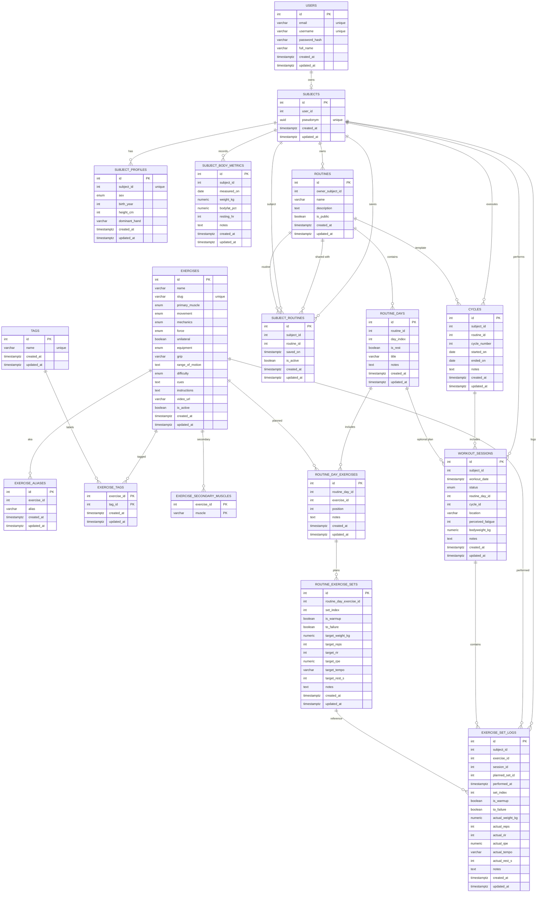

# FitnessTrack Data Model

## Entity Relationship Diagram

## Core Entities
| Table | Purpose |
| --- | --- |
| `subjects` | Pseudonymous athlete profile linked optionally to a user account. Holds relationships for owned routines, saved routines, cycles, workouts, and logs. |
| `routines` | Microcycle templates owned by a subject (`owner_subject_id`) and optionally shareable via `is_public`. |
| `subject_routines` | Association model capturing subjects that saved or adopted a routine, with `saved_on` and `is_active` status plus uniqueness on `(subject_id, routine_id)`. |
| `cycles` | Execution instances of a routine by a subject (executor) with uniqueness per `(subject_id, routine_id, cycle_number)`. |
| `workout_sessions` | Actual workout days for a subject. They may link to a routine day and/or a cycle without requiring the same routine owner. |
| `exercise_set_logs` | Set-level execution logs tied to a subject and optionally linked to workout sessions and planned sets without enforcing shared ownership. |

## Enumerations
| Enum | Values | Source |
| --- | --- | --- |
| `muscle_group` | `CHEST`, `BACK`, `SHOULDERS`, `QUADS`, `HAMSTRINGS`, `GLUTES`, `CALVES`, `BICEPS`, `TRICEPS`, `FOREARMS`, `ABS`, `OBLIQUES`, `FULL_BODY`, `OTHER` | SQLAlchemy `Exercise` model and schema. |
| `equipment` | `BARBELL`, `DUMBBELL`, `MACHINE`, `CABLE`, `BODYWEIGHT`, `KETTLEBELL`, `BAND`, `SMITH`, `TRAP_BAR`, `EZ_BAR`, `PLATE`, `OTHER` | SQLAlchemy `Exercise` model and schema. |
| `mechanics` | `COMPOUND`, `ISOLATION` | SQLAlchemy `Exercise` model and schema. |
| `force_vector` | `PUSH`, `PULL`, `STATIC` | SQLAlchemy `Exercise` model and schema. |
| `level` | `BEGINNER`, `INTERMEDIATE`, `ADVANCED` | SQLAlchemy `Exercise` model and schema. |
| `movement_pattern` | `HINGE`, `SQUAT`, `LUNGE`, `HORIZONTAL_PUSH`, `HORIZONTAL_PULL`, `VERTICAL_PUSH`, `VERTICAL_PULL`, `CARRY`, `ROTATION`, `ANTI_ROTATION`, `HIP_ABDUCTION`, `HIP_ADDUCTION`, `CALF_RAISE`, `CORE_BRACE`, `OTHER` | SQLAlchemy `Exercise` model and schema. |
| `sex` | `MALE`, `FEMALE`, `OTHER`, `PREFER_NOT_TO_SAY` | `SubjectProfile.sex` enum. |
| `workout_status` | `PENDING`, `COMPLETED` | `WorkoutSession.status` enum. |

## Detailed Entity Reference

### users
**Columns**

| Column | Type | Null? | Default | Notes |
| --- | --- | --- | --- | --- |
| `id` | PK, int | No | auto increment | From `PKMixin`. |
| `email` | varchar(254) | No | — | Unique, normalized via validator. |
| `password_hash` | varchar(128) | No | — | Write-only setter `password`. |
| `username` | varchar(50) | No | — | Unique handle. |
| `full_name` | varchar(100) | Yes | — | Optional direct PII. |
| `created_at` | timestamptz | No | `now()` | From `TimestampMixin`. |
| `updated_at` | timestamptz | No | `now()` | From `TimestampMixin`; auto updates. |

**Constraints & Indexes**

- `uq_users_email` on `email`.
- `uq_users_username` on `username`.
- Indexes: `ix_users_email`, `ix_users_username`.

**Relationships**

- One-to-one optional with `subjects` (`Subject.user_id`, `ON DELETE SET NULL`).

### subjects
**Columns**

| Column | Type | Null? | Default | Notes |
| --- | --- | --- | --- | --- |
| `id` | PK, int | No | auto increment | — |
| `user_id` | int | Yes | — | FK `users.id`, `SET NULL`. Unique per subject. |
| `pseudonym` | uuid | No | `uuid_generate_v4()` | Unique stable identifier. |
| `created_at` | timestamptz | No | `now()` | — |
| `updated_at` | timestamptz | No | `now()` | — |

**Constraints & Indexes**

- `uq_subjects_user` on `user_id` (enforces 1:1 with `users`).
- `uq_subjects_pseudonym` on `pseudonym`.
- Indexes: `ix_subjects_user_id`, `ix_subjects_pseudonym`.

**Relationships**

- Optional one-to-one to `users` (`SET NULL`).
- One-to-one to `subject_profiles` (`CASCADE`).
- One-to-many to `subject_body_metrics`, `cycles`, `workout_sessions`, `exercise_set_logs` (all `CASCADE`).
- One-to-many to `subject_routines` (association objects).
- One-to-many ownership to `routines` (`owner_subject_id`).
- Many-to-many via `subject_routines` to saved routines.

### subject_profiles
**Columns**

| Column | Type | Null? | Default | Notes |
| --- | --- | --- | --- | --- |
| `id` | PK, int | No | auto increment | — |
| `subject_id` | int | No | — | FK `subjects.id`, `CASCADE`. Unique 1:1. |
| `sex` | enum `sex` | Yes | — | Optional. |
| `birth_year` | int | Yes | — | Validators ensure ≥ 1900 and ≤ current year. |
| `height_cm` | int | Yes | — | Must be positive when present. |
| `dominant_hand` | varchar(10) | Yes | — | Trimmed validator (≤10 chars). |
| `created_at` | timestamptz | No | `now()` | — |
| `updated_at` | timestamptz | No | `now()` | — |

**Constraints & Indexes**

- `uq_subject_profiles_subject` on `subject_id`.
- Index `ix_subject_profiles_subject_id`.
- Check constraints: `ck_subject_profiles_birth_year_range`, `ck_subject_profiles_height_positive`, `ck_subject_profiles_dominant_hand_len`.

**Relationships**

- One-to-one back to `subjects` with `CASCADE`.

### subject_body_metrics
**Columns**

| Column | Type | Null? | Default | Notes |
| --- | --- | --- | --- | --- |
| `id` | PK, int | No | auto increment | — |
| `subject_id` | int | No | — | FK `subjects.id`, `CASCADE`. |
| `measured_on` | date | No | — | Unique per subject. |
| `weight_kg` | numeric(5,2) | Yes | — | Non-negative check. |
| `bodyfat_pct` | numeric(4,1) | Yes | — | Range [0,100]. |
| `resting_hr` | int | Yes | — | Positive if present. |
| `notes` | text | Yes | — | Optional. |
| `created_at` | timestamptz | No | `now()` | — |
| `updated_at` | timestamptz | No | `now()` | — |

**Constraints & Indexes**

- `uq_sbm_subject_day` on `(subject_id, measured_on)`.
- Indexes: `ix_sbm_subject_id`, `ix_sbm_measured_on`.
- Check constraints: `ck_sbm_weight_nonnegative`, `ck_sbm_bodyfat_pct_range`, `ck_sbm_resting_hr_positive`.

**Relationships**

- Many-to-one to `subjects` (`CASCADE`).

### exercises
**Columns**

| Column | Type | Null? | Default | Notes |
| --- | --- | --- | --- | --- |
| `id` | PK, int | No | auto increment | — |
| `name` | varchar(120) | No | — | Indexed. |
| `slug` | varchar(140) | No | — | Unique `uq_exercises_slug`. |
| `primary_muscle` | enum `muscle_group` | No | — | — |
| `movement` | enum `movement_pattern` | No | — | — |
| `mechanics` | enum `mechanics` | No | — | — |
| `force` | enum `force_vector` | No | — | — |
| `unilateral` | boolean | No | `false` | Server default `false`. |
| `equipment` | enum `equipment` | No | — | — |
| `grip` | varchar(50) | Yes | — | Optional. |
| `range_of_motion` | text | Yes | — | — |
| `difficulty` | enum `level` | No | `BEGINNER` | Server default. |
| `cues` | text | Yes | — | — |
| `instructions` | text | Yes | — | — |
| `video_url` | varchar(255) | Yes | — | — |
| `is_active` | boolean | No | `true` | Server default. |
| `created_at` | timestamptz | No | `now()` | — |
| `updated_at` | timestamptz | No | `now()` | — |

**Constraints & Indexes**

- `ix_exercises_name` on `name`.
- Check `ck_exercises_slug_not_empty`.

**Relationships**

- One-to-many to `exercise_aliases`, `exercise_tags`, `exercise_secondary_muscles`, `routine_day_exercises`, `exercise_set_logs` (with `CASCADE` on dependent tables where defined).

### exercise_aliases
**Columns**

| Column | Type | Null? | Default | Notes |
| --- | --- | --- | --- | --- |
| `id` | PK, int | No | auto increment | — |
| `exercise_id` | int | No | — | FK `exercises.id`, `CASCADE`. |
| `alias` | varchar(120) | No | — | Unique per exercise. |
| `created_at` | timestamptz | No | `now()` | — |
| `updated_at` | timestamptz | No | `now()` | — |

**Constraints & Indexes**

- `uq_exercise_alias` on `(exercise_id, alias)`.

**Relationships**

- Many-to-one to `exercises` (`CASCADE`).

### tags
**Columns**

| Column | Type | Null? | Default | Notes |
| --- | --- | --- | --- | --- |
| `id` | PK, int | No | auto increment | — |
| `name` | varchar(50) | No | — | Unique. |
| `created_at` | timestamptz | No | `now()` | — |
| `updated_at` | timestamptz | No | `now()` | — |

**Constraints & Indexes**

- `uq_tags_name` on `name`.

**Relationships**

- Many-to-many to `exercises` via `exercise_tags` (cascade on join rows).

### exercise_tags
**Columns**

| Column | Type | Null? | Default | Notes |
| --- | --- | --- | --- | --- |
| `exercise_id` | int | No | — | FK `exercises.id`, `CASCADE`; PK part. |
| `tag_id` | int | No | — | FK `tags.id`, `CASCADE`; PK part. |
| `created_at` | timestamptz | No | `now()` | From mixin. |
| `updated_at` | timestamptz | No | `now()` | From mixin. |

**Constraints & Indexes**

- Composite PK (`exercise_id`, `tag_id`).
- `uq_exercise_tag` on `(exercise_id, tag_id)` ensures idempotency.

**Relationships**

- Many-to-one to `exercises` and `tags` (`CASCADE`).

### exercise_secondary_muscles
**Columns**

| Column | Type | Null? | Default | Notes |
| --- | --- | --- | --- | --- |
| `exercise_id` | int | No | — | FK `exercises.id`, `CASCADE`; part of composite PK. |
| `muscle` | varchar(50) | No | — | Composite PK value. |

**Constraints & Indexes**

- `uq_exercise_muscle` on `(exercise_id, muscle)`.
- Index `ix_exercise_muscle`.

**Relationships**

- Many-to-one to `exercises` (`CASCADE`).

### routines
**Columns**

| Column | Type | Null? | Default | Notes |
| --- | --- | --- | --- | --- |
| `id` | PK, int | No | auto increment | — |
| `owner_subject_id` | int | No | — | FK `subjects.id`, `CASCADE`. |
| `name` | varchar(120) | No | — | Unique per owner. |
| `description` | text | Yes | — | Optional notes. |
| `is_public` | boolean | No | `false` | Server default enables sharing flag. |
| `created_at` | timestamptz | No | `now()` | — |
| `updated_at` | timestamptz | No | `now()` | — |

**Constraints & Indexes**

- `uq_routines_owner_name` on `(owner_subject_id, name)`.

**Relationships**

- Many-to-one to `subjects` via `owner` (propagates deletes). Owner's routines cascade delete to dependent entities.
- One-to-many to `routine_days`, `cycles`, and `subject_routines` (`CASCADE`).
- Many-to-many access via `subject_routines` to other subjects.

### subject_routines
**Columns**

| Column | Type | Null? | Default | Notes |
| --- | --- | --- | --- | --- |
| `id` | PK, int | No | auto increment | Association row id. |
| `subject_id` | int | No | — | FK `subjects.id`, `CASCADE`. |
| `routine_id` | int | No | — | FK `routines.id`, `CASCADE`. |
| `saved_on` | timestamptz | No | `now()` | Server default `now()`. |
| `is_active` | boolean | No | `false` | Tracks whether subject still follows routine. |
| `created_at` | timestamptz | No | `now()` | — |
| `updated_at` | timestamptz | No | `now()` | — |

**Constraints & Indexes**

- `uq_subject_routine` on `(subject_id, routine_id)` prevents duplicates.

**Relationships**

- Many-to-one to `subjects` and `routines` (both `CASCADE`). Serves as link between executors and shareable routines.

### routine_days
**Columns**

| Column | Type | Null? | Default | Notes |
| --- | --- | --- | --- | --- |
| `id` | PK, int | No | auto increment | — |
| `routine_id` | int | No | — | FK `routines.id`, `CASCADE`. |
| `day_index` | int | No | — | Unique per routine. |
| `is_rest` | boolean | No | `false` | Server default. |
| `title` | varchar(100) | Yes | — | Optional label. |
| `notes` | text | Yes | — | — |
| `created_at` | timestamptz | No | `now()` | — |
| `updated_at` | timestamptz | No | `now()` | — |

**Constraints & Indexes**

- `uq_routine_days_routine_day_index` on `(routine_id, day_index)`.

**Relationships**

- Many-to-one to `routines` (`CASCADE`).
- One-to-many to `routine_day_exercises` (`CASCADE`).
- Optional reference from `workout_sessions` (`SET NULL`).

### routine_day_exercises
**Columns**

| Column | Type | Null? | Default | Notes |
| --- | --- | --- | --- | --- |
| `id` | PK, int | No | auto increment | — |
| `routine_day_id` | int | No | — | FK `routine_days.id`, `CASCADE`. |
| `exercise_id` | int | No | — | FK `exercises.id`, `CASCADE`. |
| `position` | int | No | — | Unique per day. |
| `notes` | text | Yes | — | Optional instructions. |
| `created_at` | timestamptz | No | `now()` | — |
| `updated_at` | timestamptz | No | `now()` | — |

**Constraints & Indexes**

- `uq_rde_day_pos` on `(routine_day_id, position)`.
- `ix_rde_day_exercise` on `(routine_day_id, exercise_id)`.

**Relationships**

- Many-to-one to `routine_days` and `exercises` (`CASCADE`).
- One-to-many to `routine_exercise_sets` (`CASCADE`).

### routine_exercise_sets
**Columns**

| Column | Type | Null? | Default | Notes |
| --- | --- | --- | --- | --- |
| `id` | PK, int | No | auto increment | — |
| `routine_day_exercise_id` | int | No | — | FK `routine_day_exercises.id`, `CASCADE`. |
| `set_index` | int | No | — | Unique per routine_day_exercise. |
| `is_warmup` | boolean | No | `false` | Server default. |
| `to_failure` | boolean | No | `false` | Server default. |
| `target_weight_kg` | numeric(6,2) | Yes | — | Planned load. |
| `target_reps` | int | Yes | — | Planned reps. |
| `target_rir` | int | Yes | — | Planned reps-in-reserve. |
| `target_rpe` | numeric(3,1) | Yes | — | Planned RPE. |
| `target_tempo` | varchar(15) | Yes | — | Planned tempo. |
| `target_rest_s` | int | Yes | — | Planned rest in seconds. |
| `notes` | text | Yes | — | Optional. |
| `created_at` | timestamptz | No | `now()` | — |
| `updated_at` | timestamptz | No | `now()` | — |

**Constraints & Indexes**

- `uq_res_rde_set_idx` on `(routine_day_exercise_id, set_index)`.

**Relationships**

- Many-to-one to `routine_day_exercises` (`CASCADE`).
- Optional reference from `exercise_set_logs` (`SET NULL`).

### cycles
**Columns**

| Column | Type | Null? | Default | Notes |
| --- | --- | --- | --- | --- |
| `id` | PK, int | No | auto increment | — |
| `subject_id` | int | No | — | FK `subjects.id`, executor. |
| `routine_id` | int | No | — | FK `routines.id`, template. |
| `cycle_number` | int | No | — | Sequential per subject+routine, >0 check. |
| `started_on` | date | Yes | — | Optional. |
| `ended_on` | date | Yes | — | Optional. |
| `notes` | text | Yes | — | Optional. |
| `created_at` | timestamptz | No | `now()` | — |
| `updated_at` | timestamptz | No | `now()` | — |

**Constraints & Indexes**

- `uq_cycles_subject_routine_number` on `(subject_id, routine_id, cycle_number)`.
- Check `ck_cycles_number_positive` ensures positive numbering.
- Indexes: `ix_cycles_subject_started_on`, `ix_cycles_routine`.

**Relationships**

- Many-to-one to `subjects` (executor) and `routines` (template) with `CASCADE` semantics.
- One-to-many to `workout_sessions` (executor schedule).

### workout_sessions
**Columns**

| Column | Type | Null? | Default | Notes |
| --- | --- | --- | --- | --- |
| `id` | PK, int | No | auto increment | — |
| `subject_id` | int | No | — | FK `subjects.id`, `CASCADE`. |
| `workout_date` | timestamptz | No | — | Zoned date-time. |
| `status` | enum `workout_status` | No | `PENDING` | Server default. |
| `routine_day_id` | int | Yes | — | FK `routine_days.id`, `SET NULL`. Optional link to template day. |
| `cycle_id` | int | Yes | — | FK `cycles.id`, `SET NULL`. Optional link to execution cycle. |
| `location` | varchar(120) | Yes | — | Optional gym/location. |
| `perceived_fatigue` | int | Yes | — | Optional rating. |
| `bodyweight_kg` | numeric(5,2) | Yes | — | Optional weigh-in. |
| `notes` | text | Yes | — | Optional. |
| `created_at` | timestamptz | No | `now()` | — |
| `updated_at` | timestamptz | No | `now()` | — |

**Constraints & Indexes**

- `uq_ws_subject_date` on `(subject_id, workout_date)`.
- Indexes: `ix_ws_routine_day`, `ix_ws_cycle`.

**Relationships**

- Many-to-one to `subjects`, `routine_days`, and `cycles` with passive deletes.
- One-to-many to `exercise_set_logs` (optional, `SET NULL` on session delete).

**Domain Validation**

- Validator ensures `subject_id` equals `cycle.subject_id` whenever a cycle is attached (via `cycle_id` or relationship). No validation enforces routine-day ownership; linking to shared routines is allowed.

### exercise_set_logs
**Columns**

| Column | Type | Null? | Default | Notes |
| --- | --- | --- | --- | --- |
| `id` | PK, int | No | auto increment | — |
| `subject_id` | int | No | — | FK `subjects.id`, `CASCADE`. |
| `exercise_id` | int | No | — | FK `exercises.id`, `CASCADE`. |
| `session_id` | int | Yes | — | FK `workout_sessions.id`, `SET NULL`. Optional. |
| `planned_set_id` | int | Yes | — | FK `routine_exercise_sets.id`, `SET NULL`. Optional. |
| `performed_at` | timestamptz | No | — | Execution timestamp. |
| `set_index` | int | No | — | Position within session/exercise. |
| `is_warmup` | boolean | No | `false` | Server default. |
| `to_failure` | boolean | No | `false` | Server default. |
| `actual_weight_kg` | numeric(6,2) | Yes | — | Optional measured load. |
| `actual_reps` | int | Yes | — | Optional reps. |
| `actual_rir` | int | Yes | — | Optional RIR. |
| `actual_rpe` | numeric(3,1) | Yes | — | Optional RPE. |
| `actual_tempo` | varchar(15) | Yes | — | Optional tempo. |
| `actual_rest_s` | int | Yes | — | Optional rest time. |
| `notes` | text | Yes | — | Optional. |
| `created_at` | timestamptz | No | `now()` | — |
| `updated_at` | timestamptz | No | `now()` | — |

**Constraints & Indexes**

- Unique constraint `uq_esl_session_set` on `(subject_id, exercise_id, performed_at, set_index)`.
- Indexes: `ix_esl_subject_time`, `ix_esl_exercise_time`, `ix_esl_by_session`, `ix_esl_planned`.

**Relationships**

- Many-to-one to `subjects`, `exercises`, `workout_sessions`, `routine_exercise_sets`.

**Domain Validation**

- Validator enforces that `subject_id` matches `WorkoutSession.subject_id` when `session_id` is set.
- No ORM validation ties `planned_set_id` to the owning subject, allowing referencing shared templates.

## Relationships
| Relationship | Cardinality | On Delete | Notes |
| --- | --- | --- | --- |
| `users.id` → `subjects.user_id` | 1 ↔ 0..1 | `SET NULL` | Supports anonymisation by breaking PII link. |
| `subjects.id` → `subject_profiles.subject_id` | 1 ↔ 0..1 | `CASCADE` | Ensures profiles removed with subject. |
| `subjects.id` → `subject_body_metrics.subject_id` | 1 ↔ 0..N | `CASCADE` | Series data purged with subject. |
| `subjects.id` → `routines.owner_subject_id` | 1 ↔ 0..N | `CASCADE` | Routine ownership. |
| `subjects.id` ↔ `subject_routines.subject_id` | 1 ↔ 0..N | `CASCADE` | Saved/shared routines per subject. |
| `routines.id` ↔ `subject_routines.routine_id` | 1 ↔ 0..N | `CASCADE` | Removes share links when routine deleted. |
| `subjects.id` → `cycles.subject_id` | 1 ↔ 0..N | `CASCADE` | Executor-specific cycles. |
| `routines.id` → `cycles.routine_id` | 1 ↔ 0..N | `CASCADE` | Template reference. |
| `cycles.id` → `workout_sessions.cycle_id` | 1 ↔ 0..N | `SET NULL` | Sessions detach when cycle removed. |
| `routine_days.id` → `workout_sessions.routine_day_id` | 1 ↔ 0..N | `SET NULL` | Sessions may reference shared templates. |
| `subjects.id` → `workout_sessions.subject_id` | 1 ↔ 0..N | `CASCADE` | GDPR subject pattern. |
| `workout_sessions.id` → `exercise_set_logs.session_id` | 1 ↔ 0..N | `SET NULL` | Logs survive when session deleted. |
| `routine_exercise_sets.id` → `exercise_set_logs.planned_set_id` | 1 ↔ 0..N | `SET NULL` | Allows adherence analytics without ownership coupling. |
| `routine_day_exercises.id` → `routine_exercise_sets.routine_day_exercise_id` | 1 ↔ 0..N | `CASCADE` | Planned sets tied to day exercise. |
| `routine_days.id` → `routine_day_exercises.routine_day_id` | 1 ↔ 0..N | `CASCADE` | Ordered exercises per day. |
| `exercises.id` → `routine_day_exercises.exercise_id` | 1 ↔ 0..N | `CASCADE` | Template uses exercise catalog. |
| `exercises.id` → `exercise_set_logs.exercise_id` | 1 ↔ 0..N | `CASCADE` | Logs removed if exercise purged. |
| `exercises.id` → `exercise_aliases.exercise_id` | 1 ↔ 0..N | `CASCADE` | Alias cleanup. |
| `exercises.id` ↔ `exercise_tags.exercise_id` | 1 ↔ 0..N | `CASCADE` | Join table cascades. |
| `tags.id` ↔ `exercise_tags.tag_id` | 1 ↔ 0..N | `CASCADE` | Tag cleanup. |
| `exercises.id` ↔ `exercise_secondary_muscles.exercise_id` | 1 ↔ 0..N | `CASCADE` | Secondary muscles follow exercise. |

## Conventions & Constraints
- All tables inheriting `TimestampMixin` expose `created_at` / `updated_at` with database-managed `now()` defaults and automatic update on modification.
- Surrogate primary keys use `id` via `PKMixin`, except for pure association tables (`exercise_tags`, `exercise_secondary_muscles`) where composite primary keys enforce natural uniqueness.
- Soft-ownership follows the GDPR subject pattern: domain entities reference `subjects` (pseudonymous) instead of `users`.
- Unique constraints enforce natural keys per domain: e.g., `uq_routines_owner_name`, `uq_subject_routine`, `uq_cycles_subject_routine_number`.
- Application-level validators complement schema checks for domain invariants (matching subjects between sessions/cycles and logs/sessions).

## Schema vs ORM Parity
| Entity | Status |
| --- | --- |
| `users` | ORM mirrors schema columns, constraints, and indexes. |
| `subjects` | ORM enforces same unique constraints and indexes as schema. |
| `subject_profiles` | ORM adds validators mirroring DB checks; structure matches schema. |
| `subject_body_metrics` | ORM and schema aligned on unique/check constraints. |
| `exercises` | ORM includes enum columns and server defaults consistent with schema. |
| `exercise_aliases` / `exercise_tags` / `exercise_secondary_muscles` | ORM matches schema composite keys and cascades. |
| `routines` | ORM exposes `owner_subject_id` and `is_public`; `is_active` removed from both ORM and documentation. |
| `subject_routines` | Implemented as full model with timestamps, `saved_on`, `is_active`, and uniqueness. |
| `routine_days` / `routine_day_exercises` / `routine_exercise_sets` | ORM structure matches schema with unique constraints and cascades. |
| `cycles` | ORM enforces `(subject_id, routine_id, cycle_number)` uniqueness plus positive cycle numbers. |
| `workout_sessions` | ORM aligns with schema; validators ensure subject-cycle parity without restricting routine day ownership. |
| `exercise_set_logs` | ORM aligns with schema; validators only enforce session-subject parity allowing shared planned sets. |

## Development Notes
- **Routine ownership**: Migration must rename `routines.subject_id` to `owner_subject_id` (or drop/recreate) and drop legacy `is_active` usage in favor of `subject_routines.is_active`.
- **SubjectRoutine model**: Requires creation of `subject_routines` table with timestamps, `saved_on`, `is_active`, and unique constraint. Update ORM imports if exposing the model externally.
- **Cycle uniqueness**: Ensure database migration updates the unique index to `(subject_id, routine_id, cycle_number)` and removes prior owner-based constraint.
- **Validator adjustments**: Previous cross-owner validations in `WorkoutSession` and `ExerciseSetLog` should be relaxed at the ORM level; only subject-to-cycle/session parity checks remain while routine ownership checks move to application logic.
- **Sharing flows**: Application services must use `subject_routines` to authorize execution of shared/public routines and to manage `is_active` state per subject
